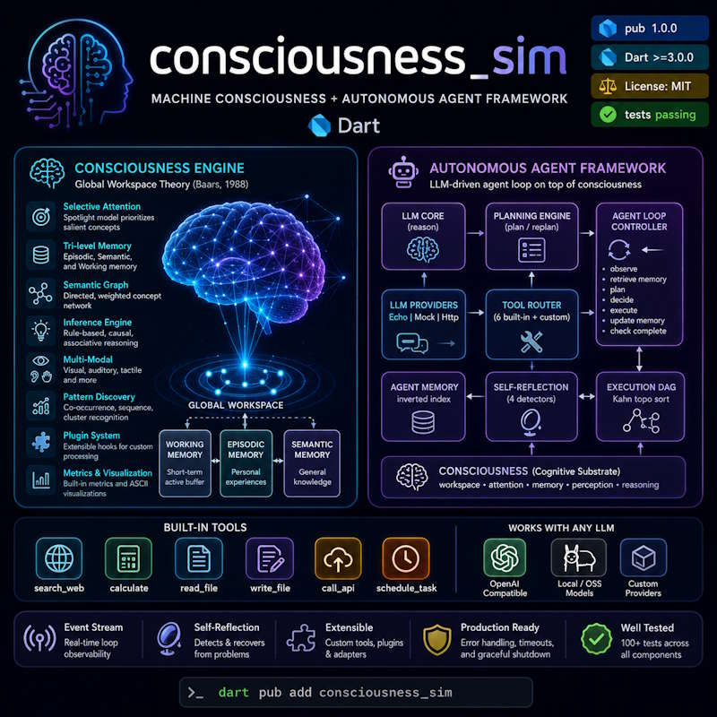

# 🧠 consciousness_sim

[](https://pub.dev/packages/consciousness_sim)
[](https://dart.dev)
[](LICENSE)
[]()

A production-ready Dart library with two integrated layers:

1. **Consciousness engine** — machine consciousness simulation based on **Global Workspace Theory** (Baars, 1988): attention spotlight, tri-level memory, semantic inference, cross-modal binding.
2. **Autonomous agent framework** — a full LLM-driven agent loop wired directly onto the consciousness engine: goal decomposition, execution DAG, tool routing, self-reflection, and memory persistence.

---





## 📦 Installation

```yaml
# pubspec.yaml
dependencies:
  consciousness_sim: ^1.0.0
```

```bash
dart pub get
```

---

## 🗂️ Table of Contents

- [Consciousness Engine](#-consciousness-engine)
  - [Quick Start](#quick-start)
  - [Core Features](#core-features)
  - [Configuration](#️-consciousness-configuration)
  - [Examples](#-consciousness-examples)
- [Autonomous Agent Framework](#-autonomous-agent-framework)
  - [Architecture](#architecture)
  - [Quick Start](#agent-quick-start)
  - [Agent Components](#agent-components)
  - [LLM Providers](#llm-providers)
  - [Tools](#-built-in-tools)
  - [Configuration](#️-agent-configuration)
  - [Production Setup](#-production-openai-setup)
  - [Events](#-event-stream)
  - [Custom Tools](#-custom-tools)
- [Running Examples](#-running-examples)
- [Running Tests](#-running-tests)
- [Documentation](#-documentation)
- [Roadmap](#️-roadmap)
- [References](#-references)

---

## 🧠 Consciousness Engine

### Quick Start

```dart
import 'package:consciousness_sim/consciousness_sim.dart';

Future<void> main() async {
  final mind = Consciousness();

  await mind.observe('a cat is sitting on the table');
  await mind.observe('the cat looks hungry');
  await mind.observe('there is fish on the table');

  print(mind.think());
  // → "The cat will likely try to eat the fish."
}
```

### Core Features

| Feature | Description |
|---------|-------------|
| 🎯 **Selective Attention** | Spotlight model with salience-based concept prioritisation |
| 🧩 **Conceptual Binding** | Temporal + semantic binding engine with co-activation |
| 🗂️ **Tri-level Memory** | Episodic, semantic, and working memory with consolidation |
| 🔗 **Semantic Graph** | Directed, weighted concept network with BFS/DFS/spreading activation |
| 💡 **Inference Engine** | Rule-based, causal, associative, and memory-driven reasoning |
| 👁️ **Multi-Modal** | Cross-modal binding for visual, auditory, tactile, and other inputs |
| 📈 **Pattern Discovery** | Co-occurrence, sequence, and cluster pattern recognition |
| 🔌 **Plugin System** | Extensible processing hooks (emotion detection, logging, etc.) |
| 📊 **Metrics & Viz** | Built-in performance metrics and ASCII workspace visualisation |

### ⚙️ Consciousness Configuration

```dart
final mind = Consciousness(
  config: ConsciousnessConfig(
    name: 'MyMind',
    workspaceCapacity: 7,              // Miller's 7±2 chunks
    attentionThreshold: 0.30,          // Min salience to enter workspace
    enableLongTermLearning: true,      // Encode to episodic/semantic memory
    enableContinuousDecay: true,       // Background activation decay
    decayIntervalSeconds: 5,           // Decay timer interval
    memoryConsolidationIntervalMinutes: 10, // Episodic→Semantic promotion
    logLevel: LogLevel.info,           // Logging verbosity
  ),
);
```

### 🔬 Consciousness Examples

#### Attention control

```dart
final mind = Consciousness(
  config: ConsciousnessConfig(workspaceCapacity: 7, attentionThreshold: 0.3),
);

await mind.observe('weather is nice');
await mind.observe('FIRE ALARM!');

print(mind.think()); // "Fire is detected — this is dangerous!"

// Redirect attention manually
mind.refocusAttention(['weather', 'temperature']);
print(mind.think()); // Now focuses on weather
```

#### Custom inference rules

```dart
mind.learn(InferenceRule(
  id: 'rule_low_battery',
  name: 'robot_low_battery',
  conditions: ['battery', 'low'],
  conclusion: 'Robot should return to charging station.',
  weight: 0.95,
));

await mind.observe('battery level is critically low');
print(mind.think()); // "Robot should return to charging station."
```

#### Multi-modal perception

```dart
await mind.observeVisual('obstacle detected ahead');
await mind.observeAuditory('collision warning beep');
await mind.observeTactile('proximity sensor: 10 cm');

final state = await mind.process();
print(mind.think()); // Synthesised from all three modalities
```

#### Memory access

```dart
final episodes = mind.recallEpisodes('cat fish');   // episodic
final facts    = mind.recallFacts('hunger');         // semantic
final all      = mind.recall('hungry animal');       // cross-memory
```

#### Plugins

```dart
class EmotionLogger extends ConsciousnessPlugin {
  @override String get name => 'EmotionLogger';

  @override
  Future<void> process(ConsciousState state) async {
    print('Workspace size: ${state.workspace.length}');
  }
}

mind.addPlugin(EmotionLogger());
```

#### Visualisation

```dart
const viz = ConsciousnessVisualizer();
final state = mind.getCurrentState();

print(viz.renderState(state));
print(viz.renderActivationMap(state.activationMap));
print(viz.renderGraph(mind.conceptGraph));
```

---

## 🤖 Autonomous Agent Framework

The agent framework layers a full LLM-driven autonomous loop onto the consciousness engine. One call — `mind.asAgent(...)` — wires all subsystems together.

### Architecture

```
┌──────────────────────────────────────────────────────────────────┐
│                        AgentMind                                 │
│                                                                  │
│  ┌──────────────┐   ┌──────────────┐   ┌────────────────────┐  │
│  │  LLMCore     │   │PlanningEngine│   │AgentLoopController │  │
│  │  (reason)    │──▶│  (plan/      │──▶│  observe           │  │
│  │              │   │   replan)    │   │  retrieveMemory     │  │
│  └──────────────┘   └──────────────┘   │  plan              │  │
│         │                              │  decide            │  │
│  ┌──────────────┐   ┌──────────────┐   │  execute           │  │
│  │ LLMProvider  │   │  ToolRouter  │   │  updateMemory      │  │
│  │ Echo│Mock│   │   │  (6 built-in │   │  checkComplete     │  │
│  │ Http         │   │  + custom)   │   └────────────────────┘  │
│  └──────────────┘   └──────────────┘            │               │
│                                                  ▼               │
│  ┌──────────────┐   ┌──────────────┐   ┌────────────────────┐  │
│  │AgentMemory   │   │SelfReflection│   │  ExecutionDAG      │  │
│  │Store         │   │Module        │   │  (Kahn topo sort)  │  │
│  │(inverted idx)│   │(4 detectors) │   │  pending→running   │  │
│  └──────────────┘   └──────────────┘   │  →succeeded/failed │  │
│                                         └────────────────────┘  │
│                                                                  │
│  ┌────────────────────────────────────────────────────────────┐ │
│  │              Consciousness (cognitive substrate)           │ │
│  │  workspace · attention · memory · perception · reasoning   │ │
│  └────────────────────────────────────────────────────────────┘ │
└──────────────────────────────────────────────────────────────────┘
```

**Loop cycle** (per iteration):

```
observe → retrieveMemory → plan → decide → execute → updateMemory → checkComplete
```

**LLM decision types** (JSON protocol):

| Action | Trigger |
|--------|---------|
| `use_tool` | Execute a named tool with structured input |
| `think` | Record an internal thought without side effects |
| `complete` | Declare the goal achieved — loop exits successfully |
| `replan` | Discard remaining tasks and generate a new plan |
| `error` | Signal an unrecoverable situation |

### Agent Quick Start

```dart
import 'package:consciousness_sim/consciousness_sim.dart';

Future<void> main() async {
  final mind = Consciousness();

  final agent = mind.asAgent(
    provider: MockLLMProvider(responses: [
      '{"action":"use_tool","tool":"calculate","input":{"expression":"42*2"},'
          '"thought":"Computing the result."}',
      '{"action":"complete","reason":"Result is 84."}',
    ]),
  );

  final result = await agent.pursue(AgentGoal(
    id: 'g-001',
    description: 'Calculate 42 × 2',
    successCriteria: ['Result returned'],
  ));

  print(result.success ? result.summary : result.error);
  // → "Result is 84."

  await agent.dispose();
  mind.dispose();
}
```

### Agent Components

| Component | Class | Responsibility |
|-----------|-------|----------------|
| **Goal model** | `AgentGoal` | Typed goal with id, description, criteria, priority, maxIterations |
| **Task graph** | `ExecutionDAG` | Kahn's topological sort; tracks pending/running/succeeded/failed/skipped |
| **LLM orchestration** | `LLMCore` | Prompt assembly, context compression, JSON parsing, token tracking |
| **Agent memory** | `AgentMemoryStore` | Inverted word index; composite score = importance × exp(−ageH/24); LRU eviction |
| **Tool system** | `ToolRegistry` / `ToolRouter` | Registration, catalogue building, dispatch with typed results |
| **Planning** | `PlanningEngine` | LLM-backed JSON decomposition + rule-based fallback; `replan()` preserves succeeded tasks |
| **Execution loop** | `AgentLoopController` | Full autonomous cycle; graceful `stop()`; `AgentLoopEvent` broadcast stream |
| **Self-reflection** | `SelfReflectionModule` | 4 detectors: cascade failures, tool loop, stalled progress, thought spiral; optional LLM deep-reflection |
| **Entry point** | `AgentMind` | Wires all layers; exposes `pursue()`, `events`, `memory`, `llm`, `tools` |

### LLM Providers

#### EchoLLMProvider *(debug)*
Echoes the last user message back as a `complete` action. Zero dependencies.

```dart
final agent = mind.asAgent(provider: EchoLLMProvider());
```

#### MockLLMProvider *(testing)*
Serves a fixed response queue then cycles. Supports keyword heuristics as fallback.

```dart
final provider = MockLLMProvider(
  name: 'mock-gpt',
  responses: [
    '{"action":"use_tool","tool":"calculate","input":{"expression":"2+2"},"thought":"..."}',
    '{"action":"complete","reason":"Done."}',
  ],
);
```

#### HttpLLMProvider *(production)*
OpenAI-compatible HTTP backend. Drop in any endpoint that follows the `/v1/chat/completions` schema.

```dart
final provider = HttpLLMProvider(
  endpoint: 'https://api.openai.com/v1/chat/completions',
  apiKey: Platform.environment['OPENAI_API_KEY']!,
  model: 'gpt-4o',
  maxTokens: 1024,
  temperature: 0.2,
);
```

### 🔧 Built-in Tools

All built-in tools follow the `ToolResult.failure()` contract — they never throw; errors are returned as structured failures.

| Tool name | Class | Description |
|-----------|-------|-------------|
| `search_web` | `SearchWebTool` | Mock/DuckDuckGo-style keyword search |
| `calculate` | `CalculateTool` | Recursive-descent math: `+−×÷`, `sqrt`, `pi`, nested parens |
| `read_file` | `ReadFileTool` | Reads a text file from disk (sandbox-restricted) |
| `write_file` | `WriteFileTool` | Writes/appends text to a file (sandbox-restricted) |
| `call_api` | `CallApiTool` | HTTP GET/POST with optional headers and body |
| `schedule_task` | `ScheduleTaskTool` | Schedules a named callback after N seconds |

Register all built-in tools in one call:

```dart
final registry = ToolRegistry();
BuiltinToolset.registerAll(registry);
```

Or let `AgentMind` do it automatically via `AgentMindConfig(registerBuiltinTools: true)`.

### ⚙️ Agent Configuration

```dart
final agent = mind.asAgent(
  provider: myProvider,
  config: AgentMindConfig(
    registerBuiltinTools: true,       // auto-register 6 built-in tools
    extraTools: [MyCustomTool()],     // additional tools
    enableReflection: true,           // self-reflection module
    loopConfig: AgentLoopConfig(
      maxConsecutiveErrors: 3,        // stop if N errors in a row
      emitEvents: true,               // broadcast AgentLoopEvent stream
      iterationDelay: Duration.zero,  // optional throttle between iterations
      reflectionIntervalIterations: 5,// self-reflection every N iterations
    ),
  ),
);
```

**`AgentGoal` fields:**

```dart
AgentGoal(
  id: 'g-001',
  description: 'Your goal description',
  successCriteria: ['Criterion 1', 'Criterion 2'],
  maxIterations: 20,      // hard cap (default 20)
  priority: 0.8,          // 0.0–1.0
  timeoutSeconds: 120,    // optional wall-clock limit
  context: {'key': 'val'} // extra context injected into prompts
)
```

### 🌐 Production OpenAI Setup

```dart
import 'dart:io';
import 'package:consciousness_sim/consciousness_sim.dart';

Future<void> main() async {
  final mind = Consciousness(
    config: const ConsciousnessConfig(name: 'ProductionAgent'),
  );

  final agent = mind.asAgent(
    provider: HttpLLMProvider(
      endpoint: 'https://api.openai.com/v1/chat/completions',
      apiKey: Platform.environment['OPENAI_API_KEY']!,
      model: 'gpt-4o',
      maxTokens: 1024,
      temperature: 0.1,
    ),
    config: AgentMindConfig(
      registerBuiltinTools: true,
      enableReflection: true,
      loopConfig: const AgentLoopConfig(
        maxConsecutiveErrors: 3,
        emitEvents: true,
        reflectionIntervalIterations: 5,
      ),
    ),
  );

  final result = await agent.pursue(AgentGoal(
    id: 'prod-task-001',
    description: 'Research quantum computing and summarise the key concepts.',
    successCriteria: ['Summary provided', 'Key concepts listed'],
    maxIterations: 15,
  ));

  print(result.success ? result.summary : 'Failed: ${result.error}');
  await agent.dispose();
  mind.dispose();
}
```

### 📡 Event Stream

Subscribe to `agent.events` for real-time observation of the loop:

```dart
agent.events.listen((AgentLoopEvent event) {
  switch (event.type) {
    case AgentLoopEventType.iterationStarted:
      print('── Iteration ${event.iteration} ──');
    case AgentLoopEventType.toolExecuted:
      final r = event.data as ToolResult?;
      print('🔧 ${r?.toolName}: ${r?.outputText}');
    case AgentLoopEventType.completed:
      print('🎯 Done: ${event.data}');
    case AgentLoopEventType.reflected:
      print('🪞 Reflection: ${event.data}');
    default:
      break;
  }
});
```

**All 14 event types:**

| Event | When emitted |
|-------|-------------|
| `iterationStarted` | Beginning of each iteration |
| `observed` | Environment observations received |
| `memoryRetrieved` | Memory lookup completed |
| `planned` | DAG (re)planned |
| `decided` | LLM decision received |
| `toolExecuted` | Tool call returned |
| `thoughtRecorded` | `think` action processed |
| `taskSucceeded` | A DAG task marked succeeded |
| `taskFailed` | A DAG task marked failed |
| `memoryUpdated` | Memory store updated |
| `replanned` | `replan` action triggered |
| `reflected` | Self-reflection module ran |
| `completed` | Loop exited with success |
| `failed` | Loop exited with failure |

### 🛠️ Custom Tools

Extend the agent with any tool by subclassing `Tool`:

```dart
class WeatherTool extends Tool {
  const WeatherTool();

  @override String get name => 'get_weather';
  @override String get description => 'Returns current weather for a city.';

  @override
  Map<String, String> get inputSchema => {
    'city': 'The city name to look up.',
  };

  @override
  Future<ToolResult> run(Map<String, dynamic> input) async {
    final city = input['city'] as String? ?? '';
    if (city.isEmpty) return ToolResult.failure(name, 'city is required');
    // call your weather API here …
    return ToolResult.success(name, 'Sunny, 22°C in $city');
  }
}

// Register it
final agent = mind.asAgent(
  provider: myProvider,
  config: AgentMindConfig(extraTools: const [WeatherTool()]),
);
```

### Custom LLM Provider

Implement `LLMProvider` to connect any backend:

```dart
class MyProvider implements LLMProvider {
  @override String get name => 'my-llm';

  @override
  Future<LLMResponse> complete(LLMRequest request) async {
    // Call your LLM service with request.messages
    final text = await myLlmClient.chat(request.messages.last.content);
    return LLMResponse(
      content: text,
      promptTokens: 0,
      completionTokens: 0,
      model: name,
    );
  }
}
```

### Custom EnvironmentAdapter

Inject real-world observations at each iteration:

```dart
class SensorAdapter implements EnvironmentAdapter {
  @override
  Future<List<AgentObservation>> poll() async {
    final reading = await sensor.read();
    return [
      AgentObservation(
        content: 'Sensor reading: $reading',
        source: 'sensor',
        salience: 0.8,
      ),
    ];
  }
}

// Pass to AgentLoopController directly, or via AgentMindConfig
```

---

## 📁 Project Layout

```
consciousness_sim/
├── lib/
│   ├── consciousness_sim.dart      ← Public API (single import)
│   ├── core/
│   │   ├── models.dart             ← Concept, Memory, Inference, ConsciousState
│   │   ├── workspace.dart          ← WorkspaceManager (7±2 buffer)
│   │   ├── attention.dart          ← AttentionSpotlight
│   │   ├── binding.dart            ← BindingEngine
│   │   └── consciousness.dart      ← Consciousness + AgentMind extension
│   ├── memory/
│   │   ├── episodic_memory.dart
│   │   ├── semantic_memory.dart
│   │   ├── working_memory.dart
│   │   └── memory_manager.dart
│   ├── perception/
│   │   ├── sensory_input.dart
│   │   ├── feature_extraction.dart
│   │   └── perception_buffer.dart
│   ├── reasoning/
│   │   ├── inference_engine.dart
│   │   ├── conceptual_graph.dart
│   │   ├── causal_inference.dart
│   │   └── pattern_recognizer.dart
│   ├── integration/
│   │   ├── cross_modal_binding.dart
│   │   ├── synchronization.dart
│   │   └── coherence_manager.dart
│   ├── utils/
│   │   ├── logger.dart
│   │   ├── metrics.dart
│   │   └── visualization.dart
│   └── agent/                      ← Autonomous agent framework
│       ├── agent_models.dart       ← AgentGoal, AgentTask, AgentDecision, …
│       ├── memory/
│       │   └── agent_memory_store.dart
│       ├── llm/
│       │   ├── llm_provider.dart   ← Echo / Mock / Http providers
│       │   └── llm_core.dart       ← LLMCore (reason, compress, parse)
│       ├── tools/
│       │   ├── tool_interface.dart ← Tool, ToolResult, ToolRegistry, ToolRouter
│       │   └── builtin_tools.dart  ← 6 built-in tools + _MathParser
│       ├── planning/
│       │   └── planning_engine.dart← ExecutionDAG + PlanningEngine
│       ├── loop/
│       │   └── agent_loop.dart     ← AgentLoopController + events + adapters
│       └── reflection/
│           └── self_reflection.dart← SelfReflectionModule (4 detectors)
├── example/
│   ├── basic_consciousness.dart    ← Consciousness quick-start
│   ├── advanced_awareness.dart     ← Attention, plugins, metrics
│   ├── learning_simulation.dart    ← Rule learning + inference
│   ├── multi_modal_integration.dart← Cross-modal binding
│   ├── autonomous_agent.dart       ← Agent with MockLLMProvider + events
│   └── multi_tool_agent.dart       ← All 6 tools + custom tool + reflection
├── test/
│   ├── core_test.dart
│   ├── memory_test.dart
│   ├── perception_test.dart
│   ├── reasoning_test.dart
│   ├── integration_test.dart
│   └── agent/
│       ├── agent_models_test.dart
│       ├── llm_core_test.dart
│       ├── tool_system_test.dart
│       ├── planning_engine_test.dart
│       └── agent_loop_test.dart
└── doc/
    ├── AGENT_ARCHITECTURE.md       ← Deep-dive agent architecture doc
    ├── THEORY.md                   ← Scientific foundations (GWT, binding, …)
    └── PERFORMANCE_GUIDE.md        ← Tuning tips and benchmarks
```

---

## 🧪 Running Examples

```bash
# Autonomous agent (MockLLMProvider, no API key needed)
dart run example/autonomous_agent.dart

# All 6 tools + custom tool + self-reflection
dart run example/multi_tool_agent.dart

# Basic consciousness demo
dart run example/basic_consciousness.dart

# Advanced attention & plugins
dart run example/advanced_awareness.dart
```

---

## ✅ Running Tests

```bash
# All tests
dart test

# Consciousness-only tests
dart test test/core_test.dart test/memory_test.dart \
          test/perception_test.dart test/reasoning_test.dart \
          test/integration_test.dart

# Agent framework tests
dart test test/agent/

# Single file
dart test test/agent/agent_loop_test.dart
```

**Test coverage:**

| Suite | What is tested |
|-------|---------------|
| `core_test` | Concept, WorkspaceManager, AttentionSpotlight, BindingEngine |
| `memory_test` | EpisodicMemory, SemanticMemory, WorkingMemory, MemoryManager |
| `perception_test` | FeatureExtractor, PerceptionBuffer, SensoryInputProcessor |
| `reasoning_test` | InferenceEngine, ConceptualGraph, CausalInference, PatternRecognizer |
| `integration_test` | CrossModalBinding, Synchronization, CoherenceManager, end-to-end |
| `agent_models_test` | AgentGoal, AgentTask, AgentDecision, AgentContext, AgentRunResult |
| `llm_core_test` | EchoLLMProvider, MockLLMProvider, LLMCore.reason(), compressContext |
| `tool_system_test` | ToolResult, ToolRegistry, ToolRouter, all 6 built-in tools |
| `planning_engine_test` | ExecutionDAG, PlanningEngine (rule-based + LLM-backed + lifecycle) |
| `agent_loop_test` | AgentLoopController, events, adapters, stop(), SelfReflectionModule |

---

## 📚 Documentation

| Document | Content |
|----------|---------|
| `README.md` | This file — getting started, API reference |
| `doc/AGENT_ARCHITECTURE.md` | Deep-dive agent architecture: layers, data flow, extension guide, config tables |
| `THEORY.md` | Scientific foundations: GWT, binding theory, memory models, inference |
| `PERFORMANCE_GUIDE.md` | Tuning tips, benchmarks, memory sizing |

---

## 🗺️ Roadmap

### v1.0 ✅ (Current)
- Core workspace + attention spotlight
- Tri-level memory (episodic, semantic, working)
- Rule-based, causal, and associative inference
- Cross-modal binding and coherence
- Pattern recognition over concept streams
- Plugin system
- **Full autonomous agent framework** (LLM + tools + planning + loop + reflection)
- 6 built-in tools + custom tool API
- MockLLMProvider for zero-config testing
- HttpLLMProvider for OpenAI-compatible backends

### v1.5 🚧
- Reinforcement learning from agent feedback
- Emotion and mood state modelling with valence tracking
- Advanced causal chains (Pearl Level 2)
- Real-time streaming perception pipeline
- Vector-embedding semantic search in `AgentMemoryStore`

### v2.0 📋
- Self-referential awareness (meta-cognition module)
- Personality and value system encoded as inference rules
- Social reasoning: multi-agent coordination
- Gradual consciousness growth simulation

### v3.0+ 🎯
- AGI-lite: creative problem solving with hypothesis generation
- Ethical reasoning and value alignment
- Full self-model and autobiographical continuity
- Multi-modal LLM integration (vision, audio)

---

## 📄 License

MIT © 2026 consciousness_sim contributors

---

## 📖 References

- Baars, B. J. (1988). *A cognitive theory of consciousness.* Cambridge University Press.
- Dehaene, S. (2014). *Consciousness and the Brain.* Viking.
- Tulving, E. (1972). Episodic and semantic memory. In *Organization of Memory* (pp. 381–403).
- Baddeley, A. D. & Hitch, G. (1974). Working memory. *Psychology of Learning and Motivation*, 8, 47–89.
- Pearl, J. (2000). *Causality: Models, Reasoning, and Inference.* Cambridge University Press.
- Miller, G. A. (1956). The magical number seven. *Psychological Review*, 63(2), 81–97.

See [THEORY.md](THEORY.md) for the complete annotated bibliography.
